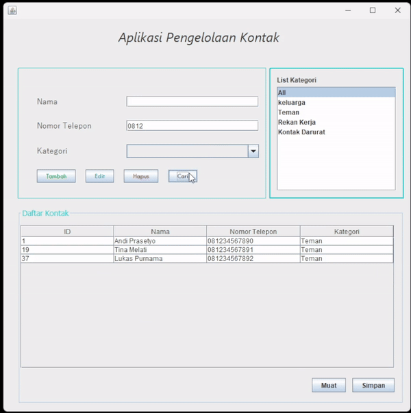

# AplikasiPengelolaKontak

Aplikasi Pengelolaan Kontak adalah sebuah aplikasi berbasis Java yang memungkinkan pengguna mengelola kontak mereka dengan mudah. Aplikasi ini menyediakan fitur untuk menambah, mengedit, menghapus, dan mencari kontak, serta mengekspor dan mengimpor data kontak dalam format CSV.

---

## Keunggulan Aplikasi

- **Antarmuka User-Friendly:** Desain intuitif menggunakan Java Swing, memudahkan navigasi dan penggunaan.    
- **Validasi Data:** Menjamin integritas data dengan validasi input, termasuk nomor telepon.  
- **Pencarian Fleksibel:** Cari kontak berdasarkan nama, nomor telepon, atau kategori.  
- **Pengelompokan Kontak:** Kategorisasi kontak seperti Keluarga, Teman, dan Rekan Kerja.  
- **Data Portability:** Mendukung ekspor dan impor data dalam format CSV.  

---

## Fitur

Aplikasi ini menawarkan beberapa fitur utama:

1. **Manajemen Kontak Lengkap**  
   Tambah, edit, hapus, dan lihat daftar kontak dengan mudah. Validasi nomor telepon (11-13 digit) untuk memastikan data valid.

2. **Pencarian dan Filter**  
   Cari kontak berdasarkan nama atau nomor telepon. Filter berdasarkan kategori untuk mempermudah pengelolaan.

3. **Pengelompokan Kontak**  
   Klasifikasikan kontak ke dalam kategori seperti Keluarga, Teman, atau Rekan Kerja.

4. **Ekspor & Impor Data**  
   Ekspor kontak ke file CSV dan impor data kontak dari file CSV dengan validasi format.

---

## Prasyarat

- **JDK 8** atau lebih tinggi  
- **NetBeans IDE**  
- **MySQL Server**  
- **XAMPP/WampServer** (opsional)  
- **MySQL JDBC Driver**  

---

## Struktur Proyek

- **KontakForm.java:** Implementasi GUI dan penanganan event.  
- **Contact.java:** Model class untuk data kontak (id, nama, nomor telepon, kategori).  
- **ContactDAO.java:** Data Access Object untuk operasi CRUD dan koneksi database.
- **DatabaseConnection.java:** Class untuk koneksi ke database.

# DEMO

# Pembuat Aplikasi
 Muhammad Akmal ( 2210010437 ) 
